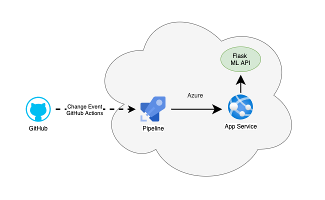
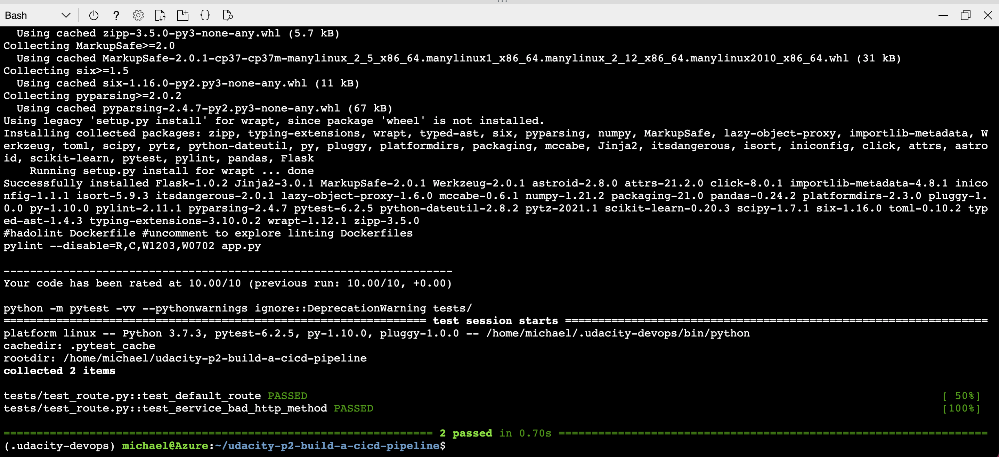
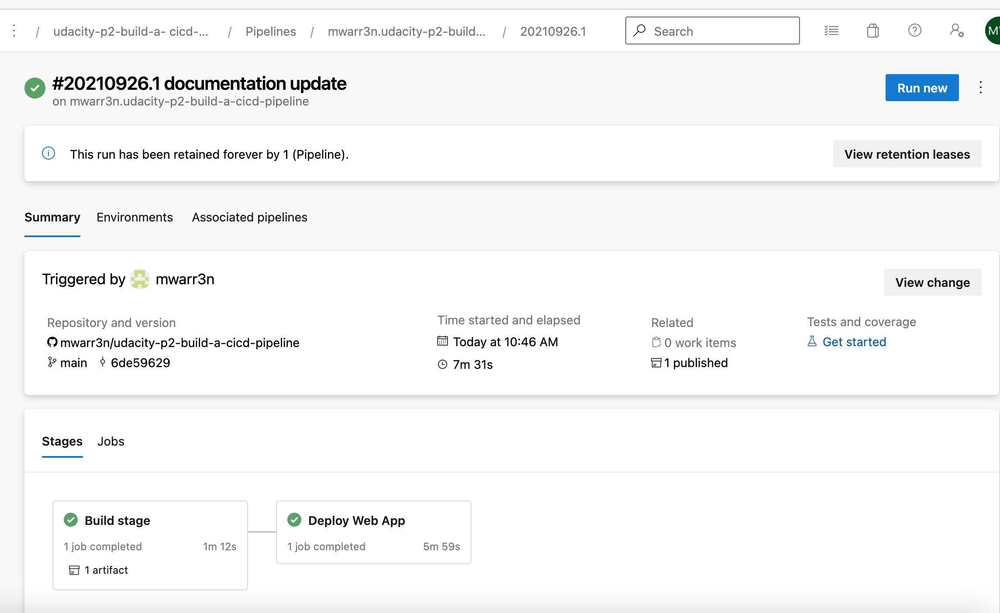
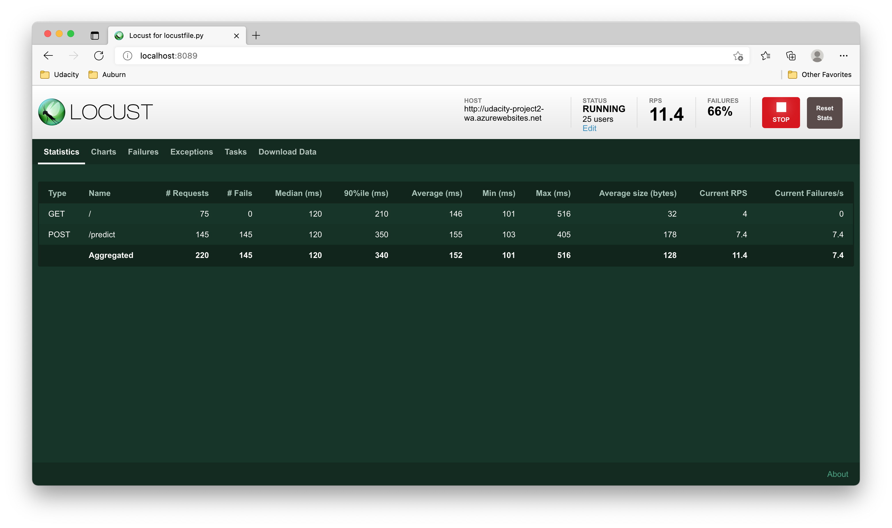
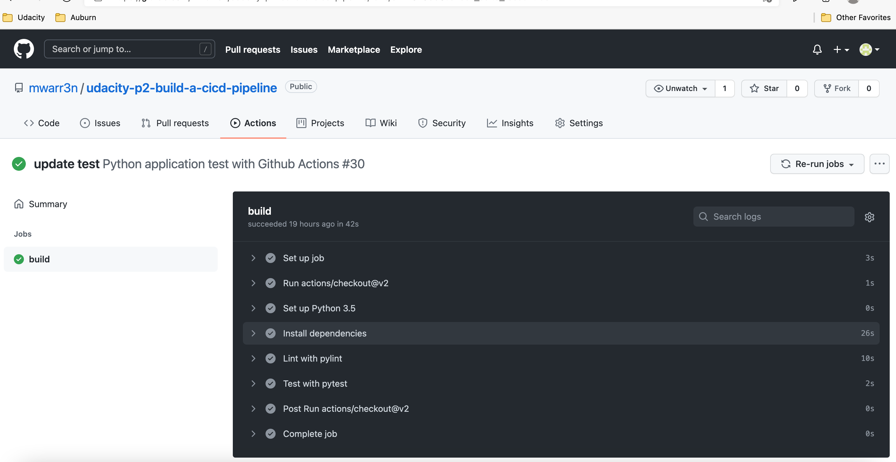
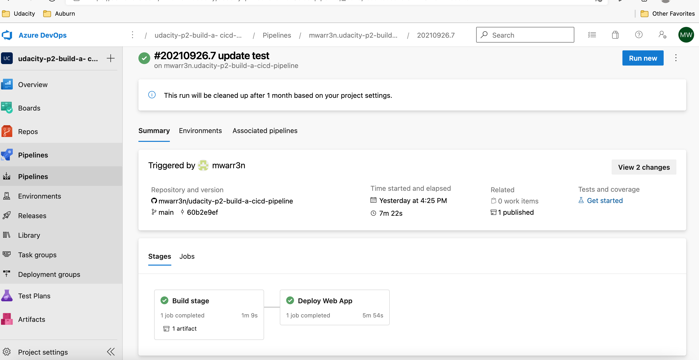
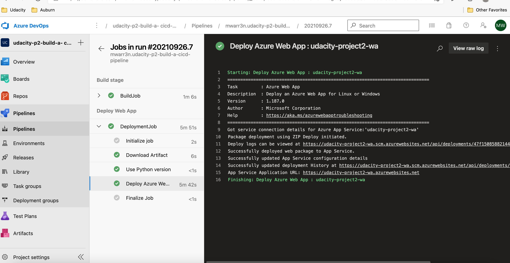

[](https://github.com/mwarr3n/udacity-p2-build-a-cicd-pipeline/actions/workflows/pythonapp.yml)

# Overview

This project will demonstrate Continuous Integration and Continuous Delivery (CI/CD) for a Python-based machine learning application using the Flask web framework. Automated code testing has been implemented using GitHub Actions. An Azure DevOps pipeline has been created to test and deploy to an Azure App Service.

Using this guide you will be able to perform the following:
* Use Azure Cloud Shell to run the application
* Deploy the application as an Azure App Service
* Setup an Azure Pipeline
* Load test the application using [Locust](https://locust.io/)

## Architectural Diagram


## Application Input and Expected Outputs
The application predicts housing prices in Boston using a pre-trained sklearn model.
```
    Input:
    {
        "CHAS":{
            "0":0
        },
        "RM":{
            "0":6.575
        },
        "TAX":{
            "0":296.0
        },
        "PTRATIO":{
            "0":15.3
        },
        "B":{
            "0":396.9
        },
        "LSTAT":{
            "0":4.98
        }
    }

    result:
    { "prediction": [ 20.35373177134412 ] }
```

## Project Plan

* A link to a Trello board for the project: [Trello Board](https://trello.com/b/FHIB0W1R/project-2-building-a-ci-cd-pipeline)
* A link to a spreadsheet that includes the original and final project plan: [Project Plan](project-management.xlsx)

# Instructions
## Azure Cloud Shell
Lets deploy the application using Azure Cloud Shell.

Clone the repo in Azure Cloud Shell:
```
git clone git@github.com:mwarr3n/udacity-p2-build-a-cicd-pipeline.git
```


Go to this folder:
```
cd udacity-p2-build-a-cicd-pipeline
```

Create environment:
```
make setup
```

Activate the environment:
```
source ~/.udacity-devops/bin/activate
```

Install dependencies in the virtual environment and run tests:
```
make all
```
Output:


Start the application:
```
python app.py
```


Open a new cloud shell and use the following to run the application:
```
cd udacity-p2-build-a-cicd-pipeline
./make_prediction.sh
```

You should see the following output:


## Azure App Service
Lets deploy the application using Azure App Services.

Open Azure Cloud Shell and navigate to the cloned project:
```
cd udacity-p2-build-a-cicd-pipeline
```

The following command deploys the code to an app service called udacity-project2-wa using resource group udacity-project2-rg.
```
az webapp up -n udacity-project2-wa -g udacity-project2-rg --sku F1
```


App Service in Azure:


Check state of newly created app service by opening a web browser and navigating to http://udacity-project2-wa.azurewebsites.net.


Test the app by executing the following command in cloud shell. 
Note: Before executing, verify the url on line 28 of make_predict_azure_app.sh matches the url of your app service. 
In cloud shell, you can use the following to execute the newly deployed app service:
```
./make_predict_azure_app.sh
```


You can use the following to view a stream of the deployed apps logs:
```
az webapp log tail -n udacity-project2-wa -g udacity-project2-rg
```


## Azure DevOps Pipeline
Lets create the pipeline in Azure DevOps. Use this guide for detailed instructions:

[Use CI/CD to deploy a Python web app to Azure App Service on Linux](https://docs.microsoft.com/en-us/azure/devops/pipelines/ecosystems/python-webapp?view=azure-devops)

Summary of process:
* Go to https://dev.azure.com
* Create a new private project
* From the project page select Project Settings
* Under Project Settings create a new service connection using Azure Resource Manager
* Configure the Azure Resource Manager scoped to your subscription and resource group
* Create a new pipeline linked to your GitHub repo



## Load Test
Load test application using locust.

Install Locust:
```
pip install locust
```

Run app:
```
python app.py
```

Open a new terminal and start locust:
```
locust
```

Open a browser and go to http://localhost:8089. Enter the total number of users to simulate, spawn rate and set the host to http://localhost:5000.  Click Start Swarming to begin load test. See the following image for values used in the test:


Locust Results:


## Enhancements
Modify the pipeline to only trigger based on an approved pull request.

## Demo 

[Demo Video](https://youtu.be/N-ZdQ2kV6Fk)


The following screenshots shows a successful build via GitHub actions and a deployment using our pipeline. The process that initiated these actions can viewed in the demo video. Please refer to the demo video starting at 3m:20s.

### Github Actions


### Pipeline Summary


### Pipeline Details



